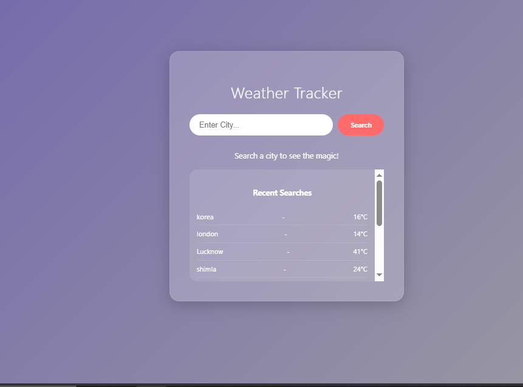
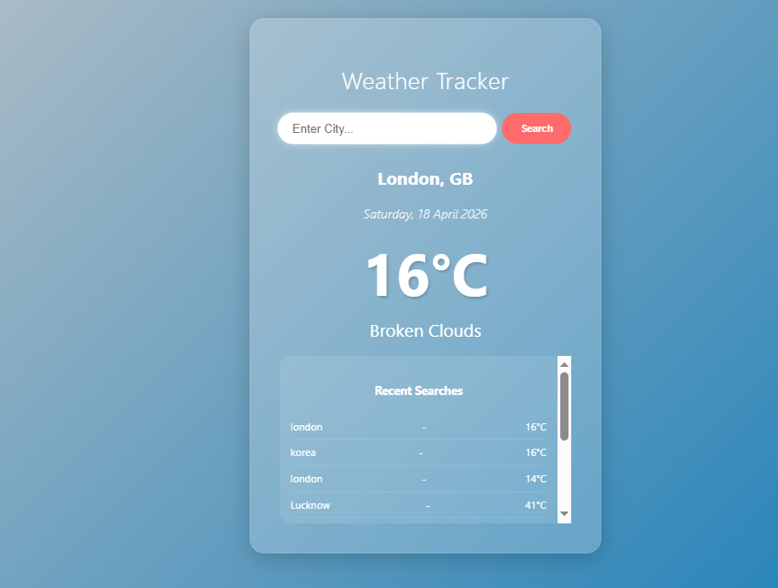
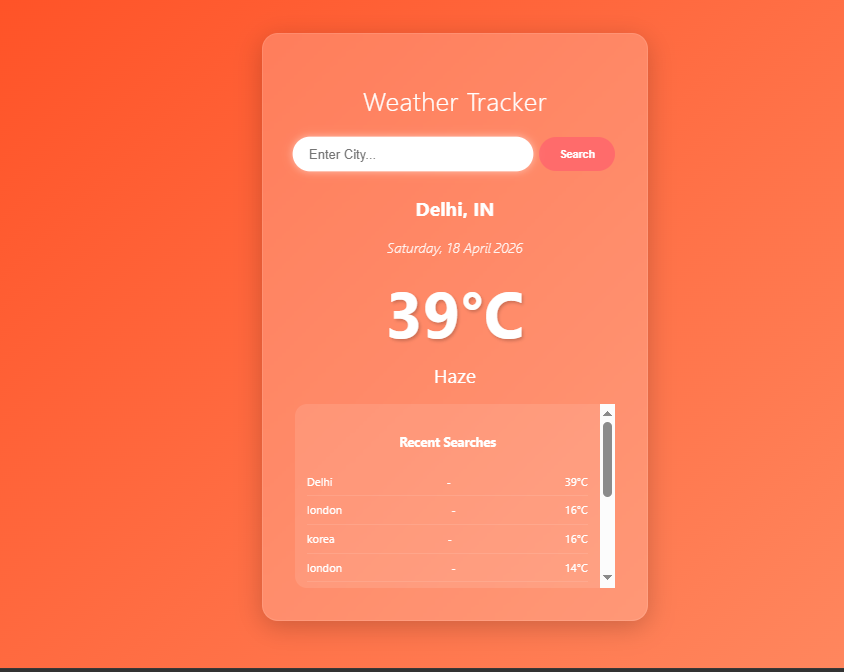
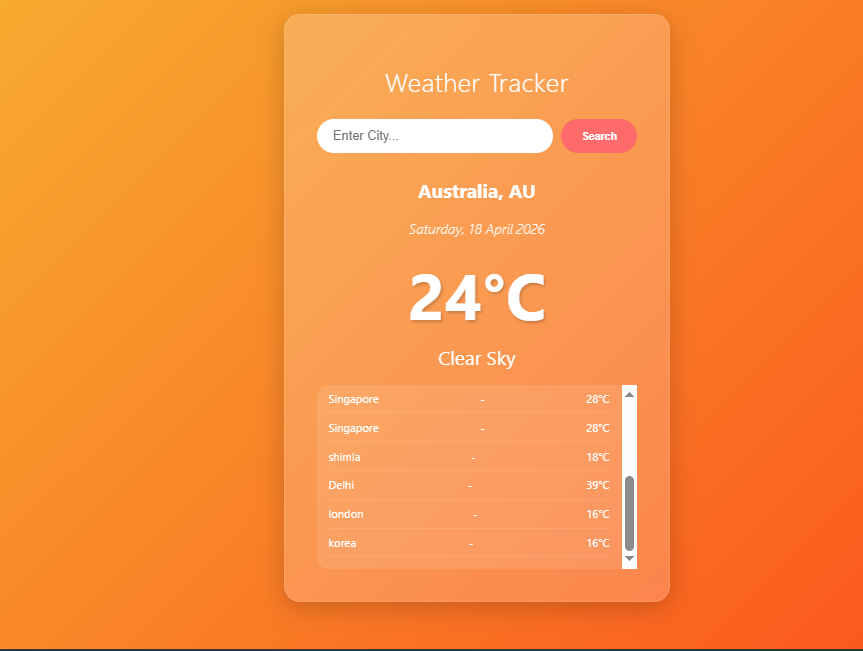

# 🌤️ Full-Stack Weather Tracker App

A real-time weather application built with a modern tech stack. It allows users to search for current weather conditions and automatically saves the search history in a persistent database.

## 📸 Project Preview

## ✨ Key Features
- **Real-time Weather Data:** Fetches live data using OpenWeatherMap API.
- **Dynamic UI:** Background colors change dynamically based on the temperature (e.g., Fiery Orange for hot weather, Cool Blue for cold).
- **Search History:** Every successful search is stored in a MySQL database and displayed in a 'Recent Searches' section.
- **Responsive Design:** Clean and modern glassmorphism UI built with React.

## 🛠️ Tech Stack
- **Frontend:** React.js, Axios, CSS3.
- **Backend:** Java, Spring Boot, Spring Data JPA.
- **Database:** MySQL.
- **Tools:** VS Code, IntelliJ IDEA, Git.

## 📁 Project Structure
- `frontend/`: React application code.
- `backend/`: Spring Boot REST API.
- `database/`: SQL scripts for database setup.

## 🚀 How to Run
1. **Database:** Import `Weather_db.sql` from the `/database` folder.
2. **Backend:** Open `/backend` in IntelliJ and run the application.
3. **Frontend:** Go to `/frontend`, run `npm install` and then `npm start`.

---
